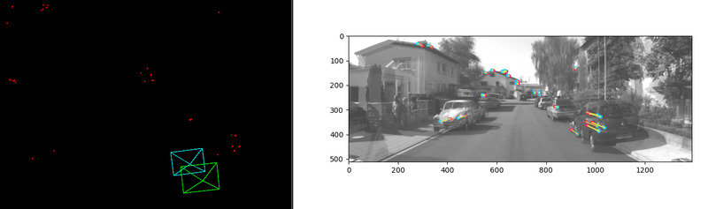

A monocular SLAM implementation. Uses the classic 8-point algorithm with Hartley normalization.

Dependencies
=======
- OpenCV
- numpy
- matplotlib for 2D image keypoint visualizations
- [Pangolin](https://github.com/uoip/pangolin) for 3D visualizations

Usage
=======
- Run `custom_slam.py` to run my implementation (doesn't use OpenCV except for ORB feature extraction, that's coming soon)
- Alternatively, run `opencv_slam.py` to see what OpenCV does

Current status
=======
- Initial establishment of camera position and triangulated points complete
- Next steps: localize camera in future frames and project other keypoints
