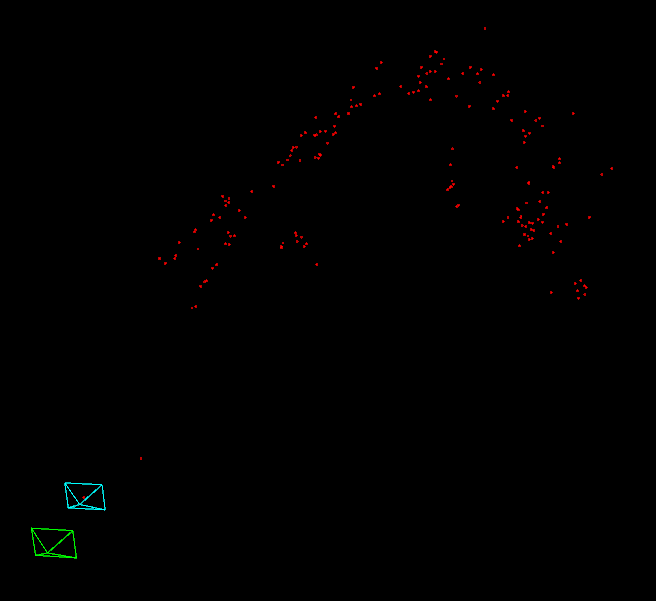

Uses OpenCV, numpy, and [Pangolin](https://github.com/uoip/pangolin)

Usage
=======
- Run `custom_slam.py` to run my complete implementation (doesn't use OpenCV except for ORB feature extraction, that's coming soon)
- Alternatively, run `opencv_slam.py` to see what OpenCV does

Current status
=======
- Initial establishment of camera position and triangulated points complete
- Next steps: triangulate future camera positions and other points
